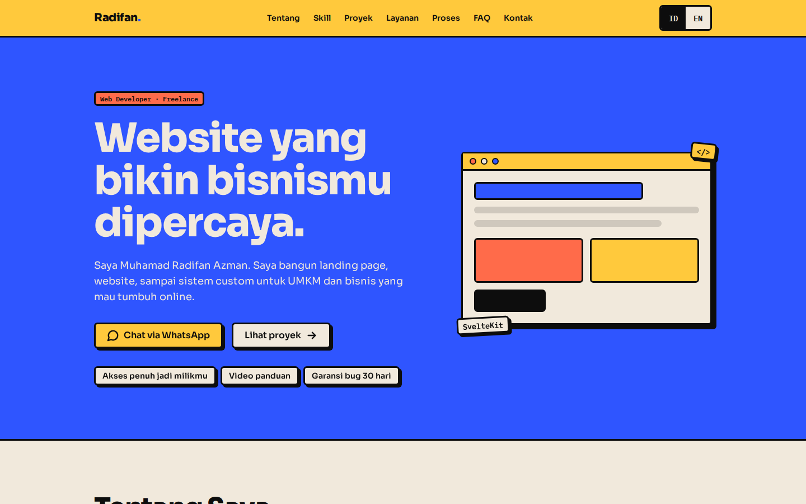
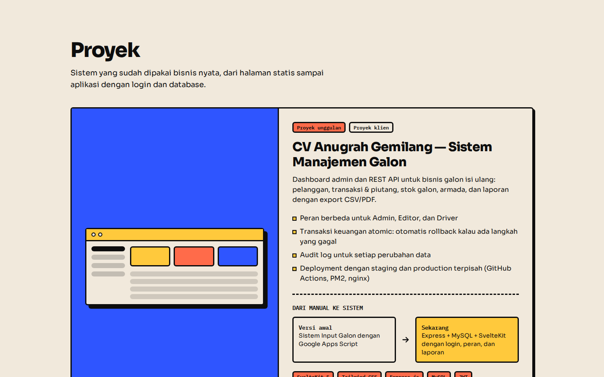
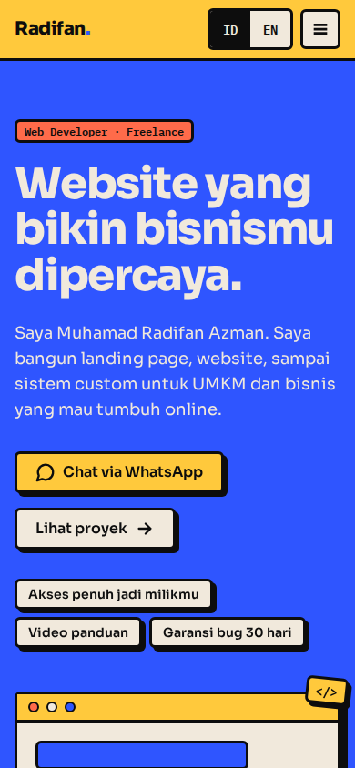
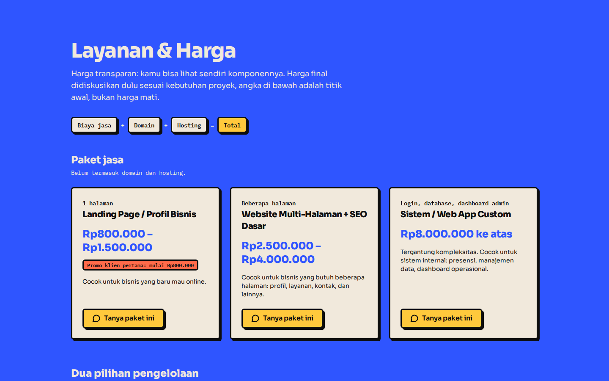
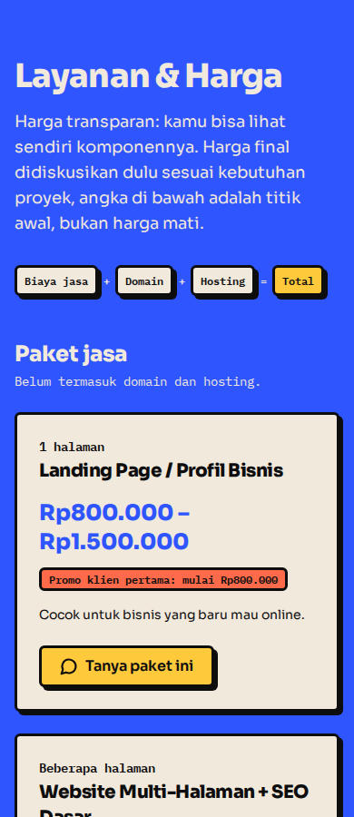

<div align="center">

# Radifan Portfolio

**Portofolio satu halaman untuk web developer freelance, dibuat untuk membangun kepercayaan calon klien dan mengarahkan mereka ke WhatsApp.**


<br />



</div>

<br />

## Tentang proyek

Situs portofolio milik **Muhamad Radifan Azman**, web developer freelance. Sasarannya jelas: calon klien (terutama UMKM yang baru mau online) bisa melihat karya nyata, memahami harga dan cara kerja, lalu langsung menghubungi lewat WhatsApp.

Gaya visualnya **neobrutalism** yang playful: border tebal, bayangan solid, warna flat, dan tipografi tebal.

## Fitur

- **Satu halaman, sembilan section:** Hero, Tentang, Skill, Proyek, Layanan & Harga, Proses Kerja, FAQ, Testimoni, dan Kontak.
- **Dua bahasa (ID/EN):** tombol ganti bahasa, pilihan diingat, dan default mengikuti bahasa browser.
- **CTA WhatsApp kontekstual:** setiap tombol membuka chat dengan pesan yang sudah terisi sesuai konteks, misalnya paket yang diminati.
- **Harga transparan:** paket jasa, dua pilihan pengelolaan (hosting bersama atau lepas kunci), estimasi domain dan hosting, serta layanan tambahan.
- **Studi kasus proyek unggulan:** sistem manajemen galon (frontend + backend) beserta cerita evolusinya dari Google Apps Script ke stack modern.
- **Analytics yang menghormati privasi:** Google Analytics 4 hanya aktif setelah pengunjung menyetujui cookie, dan klik WhatsApp dicatat sebagai event.
- **Aksesibilitas:** navigasi keyboard, fokus terlihat, tautan "Skip to content", target sentuh minimal 44px, dan `prefers-reduced-motion` dihormati.
- **Animasi terarah:** satu momen masuk di hero, elemen lain muncul sekali saat di-scroll.
- **Statis dan ringan:** di-prerender jadi file statis, siap di-host di mana saja.

## Tampilan

<table>
  <tr>
    <td width="60%"></td>
    <td width="40%"></td>
  </tr>
  <tr>
    <td align="center"><sub>Proyek unggulan dan kartu proyek</sub></td>
    <td align="center"><sub>Responsif di layar HP</sub></td>
  </tr>
  <tr>
    <td></td>
    <td></td>
  </tr>
  <tr>
    <td align="center"><sub>Layanan &amp; harga</sub></td>
    <td align="center"><sub>Layanan &amp; harga di HP</sub></td>
  </tr>
</table>

## Tech stack

| Bagian | Teknologi |
|---|---|
| Framework | [SvelteKit](https://svelte.dev/docs/kit) 2 + [Svelte 5](https://svelte.dev) (runes) |
| Styling | [Tailwind CSS](https://tailwindcss.com) 4 dengan design token sendiri |
| Bahasa | TypeScript |
| Build | [Vite](https://vite.dev) 8, `adapter-static` (prerender penuh) |
| Font | Sora dan IBM Plex Mono (Google Fonts) |
| Analytics | Google Analytics 4 (opsional, dengan persetujuan cookie) |

## Struktur proyek

```text
src/
├── app.css                 # Design token neobrutalism + kelas komponen + animasi
├── routes/
│   ├── +layout.svelte      # Header, footer, meta/SEO, banner cookie
│   └── +page.svelte        # Menyusun semua section
└── lib/
    ├── components/         # Hero, About, Skills, Projects, Services, Process, Faq, Testimonials, Contact, ...
    ├── i18n/               # Kamus teks id.ts dan en.ts
    ├── actions/reveal.ts   # Efek muncul sekali saat di-scroll
    ├── analytics.ts        # Google Analytics + persetujuan cookie
    ├── config.ts           # Data kontak dan pembuat link WhatsApp
    ├── projects.ts         # Data proyek
    ├── skills.ts           # Data skill per level
    └── testimonials.ts     # Daftar testimoni (kosong = section disembunyikan)
docs/
└── PRD.md                  # Tujuan, batasan, dan kriteria selesai
```

## Memulai

Prasyarat: Node.js 20.19 atau lebih baru (atau 22.12+).

```sh
git clone https://github.com/mrdfn20/radifan-portfolio.git
cd radifan-portfolio
npm install
npm run dev        # http://localhost:5173
```

| Perintah | Fungsi |
|---|---|
| `npm run dev` | Server pengembangan |
| `npm run check` | Type check dengan `svelte-check` |
| `npm run build` | Build statis ke folder `build/` |
| `npm run preview` | Pratinjau hasil build |

## Konfigurasi

**Google Analytics (opsional).** Salin `.env.example` ke `.env`, lalu isi Measurement ID:

```sh
VITE_GA_ID=G-XXXXXXXXXX
```

Tanpa ID, analytics dan banner cookie nonaktif.

**Mengubah konten.** Semua isi ada di satu tempat per jenis:

| Yang diubah | File |
|---|---|
| Nomor WhatsApp, email, dan tautan sosial | `src/lib/config.ts` |
| Teks halaman (ID dan EN) | `src/lib/i18n/id.ts`, `src/lib/i18n/en.ts` |
| Daftar proyek dan link repo | `src/lib/projects.ts` |
| Daftar skill | `src/lib/skills.ts` |
| Testimoni (section tampil otomatis begitu terisi) | `src/lib/testimonials.ts` |
| Warna, font, dan bayangan | `@theme` di `src/app.css` |

## Deploy

Hasil build adalah situs statis, jadi bisa di-host di Vercel, Netlify, Cloudflare Pages, atau server statis biasa.

- **Build command:** `npm run build`
- **Output directory:** `build`
- **Environment variable:** `VITE_GA_ID` (kalau memakai analytics)

## Dokumentasi

Tujuan, keputusan desain, batasan (apa yang sengaja tidak dikerjakan), dan kriteria selesai tercatat di [`docs/PRD.md`](docs/PRD.md).

## Kontak

**Muhamad Radifan Azman**, web developer freelance

[](https://wa.me/6287783798810)
[](mailto:radifan.azman@gmail.com)
[](https://id.linkedin.com/in/mradifanazman)
[](https://www.instagram.com/radifanazman/)
[](https://github.com/mrdfn20)
